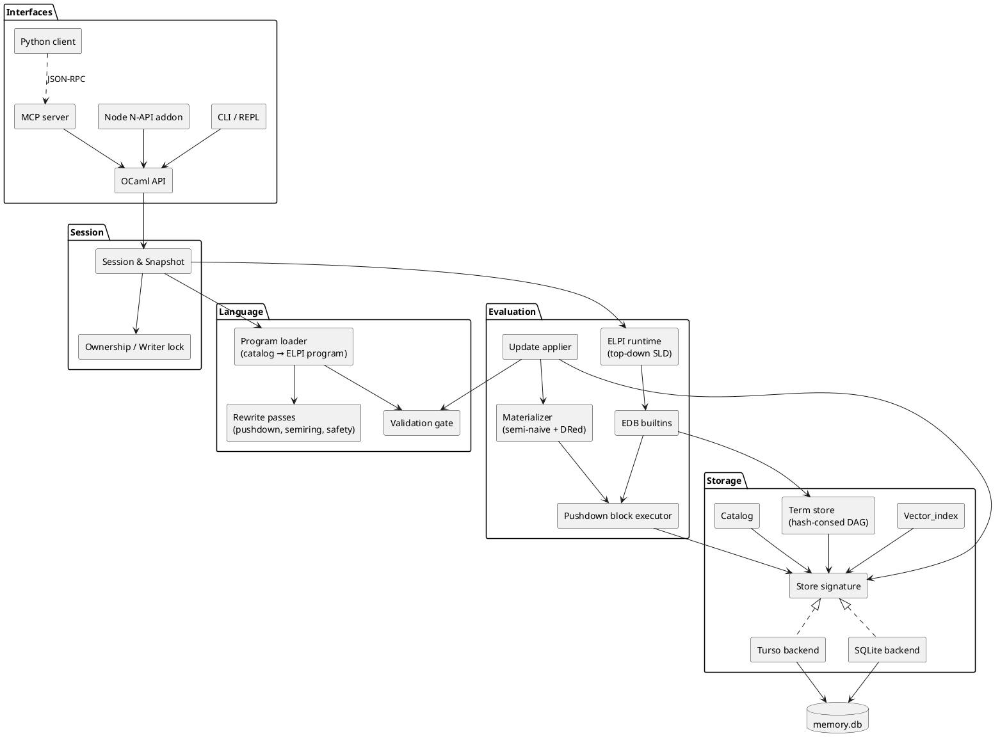
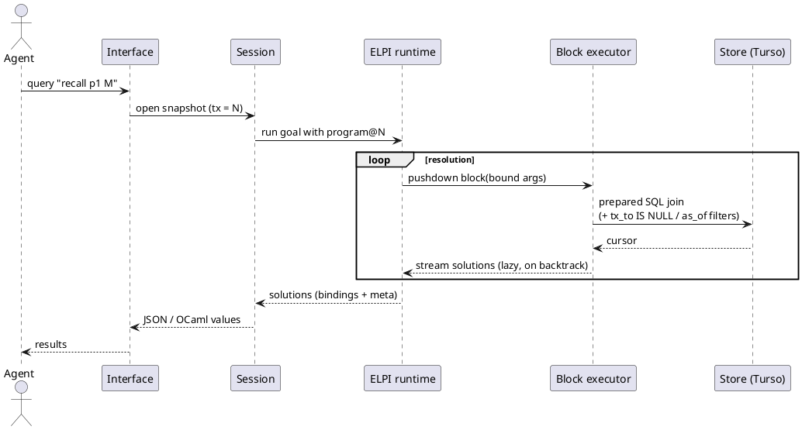
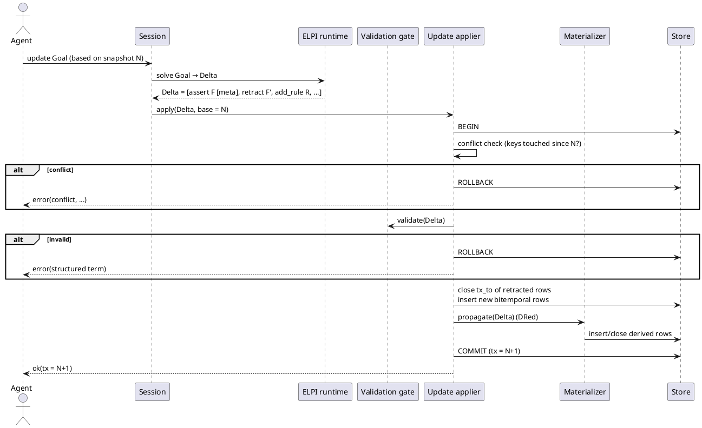

# Architecture

elpilite is a hybrid engine: stored relations live in Turso/SQLite and are exposed to ELPI as OCaml builtins, while rules and higher-order reasoning run natively in ELPI.

See [[decisions#D1 Hybrid execution]] for why neither "ELPI over dumb storage" nor "ELPI compiled to SQL" alone was chosen.

## Layers

The system is five layers; each only talks to the one directly below it.



## Components

Each component owns one concern; the list maps components to the knowledge-base section that specifies them.

| Component | Responsibility | Spec |
|---|---|---|
| `Store` | Backend-neutral SQL access, transactions, prepared cursors | [[storage#Store Signature]] |
| Term store | Interning, hash-consing, de Bruijn encoding of λ-terms | [[storage#Term DAG]] |
| Catalog | Persistent declarations, constraints, rules, versions | [[storage#Catalog]] |
| `Vector_index` | Similarity search per backend | [[vectors#Vector Index]] |
| Program loader | Rebuilds the ELPI program from the catalog for a snapshot | [[rules#Loading]] |
| Rewrite passes | Pushdown blocks, `:weighted` threading, safety checks | [[evaluation#Rewrite Pipeline]] |
| EDB builtins | Stored relations as nondeterministic ELPI predicates | [[evaluation#EDB Builtins]] |
| Materializer | Semi-naive fixpoint and incremental maintenance | [[evaluation#Materialized Views]] |
| Update applier | Validates and commits deltas atomically | [[language#Updates]] |
| Validation gate | Type, mode, fragment, stratification, trial-run checks | [[rules#Validation Gate]] |
| Session | Snapshot lifecycle, step limits, cancellation | [[language#Snapshots]] |
| Ownership | One writer per file; read-only or proxy for others | [[interfaces#Writer Ownership]] |

## Query Flow

A read query runs over a fixed snapshot; stored-relation goals are batched into SQL, everything else resolves in ELPI.



## Update Flow

Writes are computed as a delta by a pure goal, then validated, written, and propagated in one transaction.



## Source Layout

The planned dune layout mirrors the layers; library names are prefixed `elpilite_`.

```
bin/elpilite.ml            CLI / REPL / MCP entry point
src/store/                 Store signature, Turso + SQLite backends, Vector_index
src/terms/                 interning, hash-consing, de Bruijn, (de)serialisation
src/catalog/               declarations, constraints, rules, versions
src/lang/                  loader, rewrite passes, validation gate, errors
src/eval/                  EDB builtins, block executor, materializer, semirings
src/session/               snapshots, updates, ownership, step limits
src/mcp/                   MCP server (stdio + HTTP)
bindings/node/             N-API addon (C stubs + TS wrapper)
clients/python/            thin MCP/HTTP client
elpi/prelude.elpi          engine builtins' ELPI signatures
examples/                  reference memory models (not loaded by default)
test/                      unit, property, differential, e2e
```
