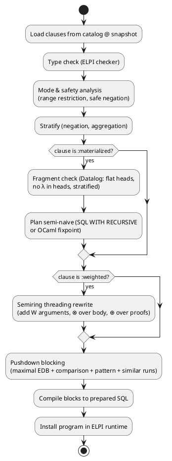
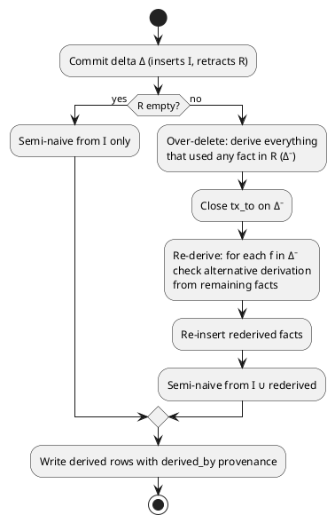

# Evaluation

How goals are executed: ELPI top-down resolution by default, stored relations as streaming builtins, relational blocks pushed down to SQL, and opt-in materialized and weighted predicates.

## EDB Builtins

Each `:persistent` predicate is registered as an OCaml builtin that enumerates matching current rows as ELPI solutions on backtracking.

- Bound arguments become SQL `WHERE` equalities (scalars directly, compound terms by hash-consed id lookup).
- Unbound arguments are returned; term ids are decoded through the term cache.
- Results are streamed from a cursor; ELPI backtracking pulls the next row. No full materialisation of results.
- Snapshot, namespace and valid-time filters are injected by the builtin, never written by users.

## Top-Down Resolution

Everything not pushed down or materialized runs as ordinary ELPI SLD resolution, bounded by a step and depth limit.

- ELPI has no tabling, so left-recursive rules loop; instead of trusting users, every session enforces configurable `max_steps` and `max_depth` and raises `error (step_limit N)` / `error (depth_limit D)` ([[decisions#D7 Hybrid evaluation]]).
- Agents generating rules at runtime will write left recursion; the error term names the predicate so they can rewrite it or mark it `:materialized`.
- Higher-order goals, `=>` (hypothetical reasoning: "assume X, what follows?"), `pi`, and constraint handling rules run only here.

## Rewrite Pipeline

At program load the engine runs source-to-source passes over the quoted program, implemented in ELPI itself.



## Conjunction Pushdown

Maximal runs of stored-relation goals, comparisons, term patterns and similarity goals in a clause body compile to a single streaming SQL join.

Without pushdown, `about M P, episode M T _, importance M I` issues 1 + N + N queries (the N+1 problem). With pushdown:

```sql
SELECT a.c0, e.c1, i.c1
  FROM r_about a
  JOIN r_episode e    ON e.c0 = a.c0
  JOIN r_importance i ON i.c0 = a.c0
 WHERE a.c1 = ?1 AND e.c1 > 1700000000 AND i.c1 > 0.5
   AND a.tx_to IS NULL AND e.tx_to IS NULL AND i.tx_to IS NULL
   AND a.ns IN (?2) AND e.ns IN (?2) AND i.ns IN (?2)
```

Block rules:

- A block **ends** at: an IDB call, a higher-order goal, `=>`, `pi`, cut `!`, or any builtin not known to be pushdown-safe.
- Join order inside a block is left to the SQL planner — sound because queries are pure ([[decisions#D13 Pushdown]]).
- `not G` over stored relations becomes `NOT EXISTS`; aggregates become `GROUP BY` / `ORDER BY … LIMIT`.
- `as_of` / `valid_at` / `in_ns` rewrite the injected filters.
- **Solution order is unspecified**; cuts over stored relations are discouraged in favour of `first` / `top_k`.

### Term Pattern Pushdown

Goals whose arguments are partially instantiated compound terms join the term table on functor and arity.

`about M (project_topic _)` becomes `JOIN term t ON t.id = a.c1 AND t.head = :sym_project_topic AND t.arity = 1`. Nested patterns join once per level up to a configurable depth (default 3); deeper matching falls back to ELPI unification on decoded terms.

### Similarity In Blocks

A `similar` goal inside a block becomes a table-valued vector search joined with the symbolic filters.

The planner chooses pre-filter (symbolic candidates, then exact distance) or post-filter (ANN top-k', then symbolic filters, with k' over-fetch) from estimated selectivity. See [[vectors#Hybrid Retrieval]].

## Materialized Views

Predicates marked `:materialized` are restricted to a Datalog fragment, evaluated bottom-up with semi-naive iteration, stored as real bitemporal rows, and maintained incrementally.

- **Fragment:** flat or term-id arguments, range-restricted, stratified negation and aggregation, no λ-terms or `=>` in the body, no higher-order calls. Violations are rejected at load time — never silently downgraded.
- **Execution:** linear recursion compiles to `WITH RECURSIVE`; non-linear or mutual recursion runs an OCaml semi-naive loop issuing delta joins.
- **Maintenance:** DRed (delete–rederive) on each commit, driven by the delta ([[language#Updates]]). Insert-only deltas take the cheap semi-naive path.
- **Provenance:** each derived row's `src` is `derived_by RuleId [PremiseFids]` (or top-k proofs for weighted rules), so `as_of`, `meta` and explanations work on derived knowledge.
- Typical agent use: consolidation of episodic into semantic memory, reachability over a knowledge graph.



## Semiring Provenance

Predicates marked `:weighted` are rewritten to thread a semiring value through derivations; the semiring is chosen per query.

| Semiring | ⊕ (alternatives) | ⊗ (conjunction) | Meaning | Idempotent |
|---|---|---|---|---|
| `max_product` | max | × | best-proof confidence (Viterbi) | yes |
| `min_max` | max | min | fuzzy logic | yes |
| `top_k K` | merge-keep-k | product-of-proofs | k best proofs = explanations | yes |
| `add_mult` | + (capped at 1) | × | approximate probability | **no** |

- Base weights come from the `conf` column of stored facts; rules can carry a weight (`:weighted 0.8`).
- Unmarked predicates are crisp and pay no overhead.
- Recursive `:weighted :materialized` predicates require an **idempotent** semiring; `add_mult` with recursion is rejected at load time (fixpoint would not converge).
- `top_k` proofs are stored as `src` when a weighted derived fact is materialized, doubling as explanations.
- Exact probabilistic inference (ProbLog-style) is out of scope; differentiable semirings (dual numbers) are a planned extension ([[decisions#D6 Semirings]]).

```prolog
:weighted
safe X :- at X home, locked home.

?- with_semiring max_product (safe alice) W.      % W = 0.72
?- with_semiring (top_k 3) (safe alice) Proofs.   % three best derivations
```
