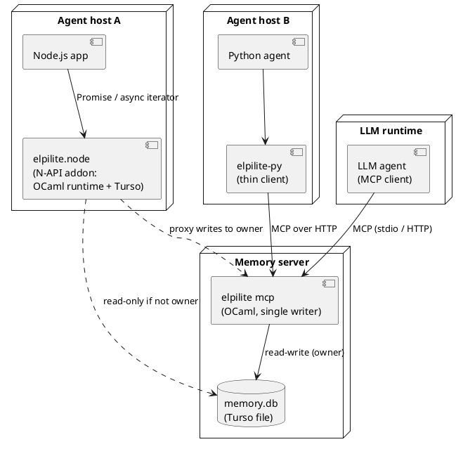

# Interfaces

Five client surfaces over one OCaml core: the library, a CLI/REPL, an MCP server, a Python client, and a native Node.js addon.

## Deployment

Embedded mode (library, Node addon, CLI) opens the file directly; multi-process setups route writes through whichever process owns the file.



## OCaml Library

The core API every other surface wraps; direct-style, snapshot-based.

```ocaml
val open_     : ?backend:[`Turso | `Sqlite] -> ?mode:[`Rw | `Ro | `Auto] -> string -> Db.t
val query     : Db.t -> ?limits:Limits.t -> ?as_of:int -> string -> Solution.t Seq.t
val update    : Db.t -> ?base:int -> string -> (Tx.t, Error.t) result
val import    : Db.t -> string -> (Tx.t, Error.t) result
val export    : Db.t -> ?as_of:int -> unit -> string
val register_builtin : Db.t -> Builtin.t -> unit        (* e.g. embed/2 *)
```

`Solution.t` carries bindings (as ELPI terms or JSON), optional `meta` and optional proofs.

## CLI And REPL

`elpilite` is one binary with subcommands for humans, tests and scripts.

```
elpilite repl   memory.db                  # interactive ELPI queries, :as_of, :explain, :meta
elpilite query  memory.db 'recall p1 M'    # one-shot, JSON lines out
elpilite update memory.db 'update (...)'
elpilite import memory.db schema.elpi
elpilite export memory.db --as-of 1200 > snapshot.elpi
elpilite mcp    memory.db [--http :7411]   # MCP server (becomes owner)
elpilite check  memory.db                  # integrity + differential check vs SQLite backend
```

## MCP Server

The MCP server is the primary interface for LLM agents and the natural single-writer process.

Tools exposed:

| tool | input | output |
|---|---|---|
| `query` | ELPI goal text, limits, `as_of`, `ns` | solutions JSON |
| `remember` | fact term text + metadata | `tx` |
| `update` | ELPI `update` goal text, `base_tx` | `tx` or structured error |
| `add_rule` | clause text + attributes | rule id or structured error |
| `recall_similar` | vector (or text if `embed` hook), k, filter goal | ranked items |
| `explain` | fact term | provenance / top-k proofs |
| `schema` | — | current declarations and constraints as ELPI text |
| `history` | fact pattern | all versions (`all_versions`) |

Transports: stdio (for local agent runtimes) and streamable HTTP (for remote/multi-process).

## Wire Format

Queries, rules and updates travel as ELPI source text; results and errors return as JSON.

```json
{ "tx": 1204,
  "solutions": [
    { "bindings": { "M": {"f": "mem", "args": [{"int": 42}]},
                    "S": {"float": 0.83} },
      "meta": {"conf": 0.9, "tx_from": 1180, "src": {"f": "tool", "args": [{"str": "crm"}]}} } ],
  "more": true }
```

Errors mirror the ELPI error term: `{"error": {"f": "type_error", "args": [...]}}` ([[rules#Validation Gate]]).

## Python Client

A thin pure-Python package speaking MCP over HTTP (or stdio for a spawned server); no native bindings.

It exposes `Db.query`, `Db.update`, `Db.recall_similar`, decoding terms into small dataclasses, and accepts numpy arrays for vectors.

## Node Addon

A native N-API addon links the OCaml runtime and Turso in-process for embedded, serverless use from Node.js.

- Built with `ocamlfind ocamlopt -output-complete-obj` into a static object linked into the `.node` module; distributed as per-platform prebuilds.
- **Threading:** one dedicated OCaml thread owns the runtime, the Turso connection and the ELPI state. JS calls enqueue requests and receive Promises; results are marshalled on the main thread via `napi_threadsafe_function`. The Node event loop is never blocked.
- **Streaming:** `for await (const sol of db.query("recall p1 M"))` maps ELPI backtracking to an async iterator.
- **Cancellation:** `AbortSignal` sets a flag checked at the step-limit check points ([[language#Queries]]).
- **Platforms (v1):** macOS arm64/x64, Linux x64/arm64 (glibc). musl and Windows deferred.
- A WebAssembly build (`wasm_of_ocaml` + Turso WASM) is a possible future target; the core avoids direct Unix/threads dependencies to keep that open.

```ts
import { open } from "elpilite";
const db = await open("memory.db");            // owner if lock free, else read-only + proxy
for await (const s of db.query("recall p1 M", { signal })) console.log(s.bindings.M);
await db.update(`update (Delta = [assert (knows alice bob 0.9) [conf 0.9]])`);
```

## Writer Ownership

Exactly one process owns write access to a database file; other openers get read-only access or proxy writes to the owner.

- The first read-write opener takes an OS advisory lock and writes an `owner` row (pid, kind, endpoint) ([[storage#Catalog]]).
- Later openers with `mode = Auto` open read-only and, if the owner row has an endpoint, proxy `update` calls to it over MCP/HTTP.
- Stale ownership (dead pid, released lock) is taken over on next open.
- Proxied updates carry `base_tx` for the optimistic conflict check ([[language#Updates]]).
- Revisit once Turso MVCC supports indexes ([[decisions#D4 Turso primary]]).
