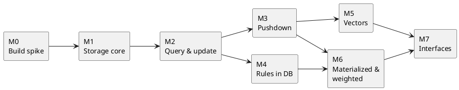

# Roadmap

Eight milestones, each building on a working, tested layer; interfaces come last because they wrap a stable core.

## M0 Build Spike

De-risk the toolchain: `sqlite3-ocaml` linked against Turso's C library, ELPI 1.18 embedded, one builtin reading a table.

Done when `dune test` passes on macOS and Linux CI and a gap list of missing Turso C-API symbols (if any) is recorded.

Outcome: both backends load in one process via [[storage#Store Signature#Backend Loading]]; ELPI goals stream rows lazily (one solution ⇒ one row fetched); the gap list is in [[storage#Store Signature#Turso C-API Gap List]].

Toolchain findings recorded during the spike:

- The project uses a local opam switch (`_opam/`, OCaml 5.3.0) created by `make switch`; `scripts/sw` runs any command inside it with a clean environment.
- OCaml 5.1.1 crashed under parallel load on macOS 26 (Darwin 25); 5.3.0 is used instead.
- On macOS 26, `dune` (built with OCaml 5.x) segfaults when running jobs in parallel and `ocamlbuild` segfaults on any build; the `Makefile` builds with `-j 1` on Darwin, and `alcotest` (needs `ocamlbuild` via `topkg`) is replaced by the in-house runner `test/support/testkit.ml`. Linux CI is unaffected.
- Turso requires Rust 1.88 (`rust-toolchain.toml`); `scripts/build-turso.sh` installs it via rustup.

## M1 Storage Core

`Store` signature with both backends, term DAG, catalog, `:persistent` DDL, typed insert and lookup, bitemporal columns.

Done when round-trip property tests (any typed term in = same term out) and backend differential tests pass. See [[storage]].

## M2 Query And Update

Snapshot queries, `update` deltas with validation, constraints, `as_of`/`valid_at`, `meta`, negation, aggregates, step limits.

Done when a reference suite of ELPI programs with expected answers passes on both backends. See [[language]].

## M3 Pushdown

Conjunction pushdown including term patterns, negation and aggregates.

Done when pushdown answers equal naive per-call answers on the whole suite and an N+1 benchmark shows the speedup. See [[evaluation#Conjunction Pushdown]].

## M4 Rules In DB

Program-as-data, loader cache, validation gate, structured errors, migrations, capabilities.

Done when an LLM-style fuzz test (random and malformed rules) never corrupts state and every rejection is a structured error. See [[rules]].

## M5 Vectors

`vec` type, `Vector_index` on both backends, `similar`, `rank_recall`, access tracking.

Done when a hybrid benchmark (vector + symbolic filter) meets the targets below. See [[vectors]].

## M6 Materialized And Weighted

`:materialized` with semi-naive and DRed; `:weighted` with the four semirings, top-k proofs, `derived_by` provenance; scheduled jobs and forgetting.

Done when incremental maintenance equals full recomputation in property tests. See [[evaluation#Materialized Views]].

## M7 Interfaces

CLI/REPL, MCP server with ownership, Python client, Node N-API addon with prebuilds.

Done when an end-to-end agent demo in `examples/` runs through MCP, Python and Node. See [[interfaces]].

## OpenSpec Changes

Each milestone is one OpenSpec change under `openspec/changes/`, archived into `openspec/specs/` and committed when complete.

| Milestone | Change |
|---|---|
| M0 | `elpilite-m0-build-spike` (tooling, no spec deltas) |
| M1 | `elpilite-m1-storage-core` |
| M2 | `elpilite-m2-query-update` |
| M3 | `elpilite-m3-pushdown` |
| M4 | `elpilite-m4-program-catalog` |
| M5 | `elpilite-m5-vectors` |
| M6 | `elpilite-m6-derived-reasoning` |
| M7 | `elpilite-m7-interfaces` |

## Testing Strategy

Every optimisation has a naive twin and every backend has a differential twin; property tests generate the inputs.

- **Backend differential:** Turso vs SQLite on every suite.
- **Pushdown differential:** pushed-down vs per-call evaluation.
- **Incremental differential:** DRed-maintained views vs recompute-from-scratch.
- **Property tests (QCheck):** term round-trip, α-equivalence ⇒ same id, bitemporal invariants (no two current rows per key per valid interval), `as_of` monotonicity.
- **Fuzzing:** random/malformed ELPI rules and deltas against the validation gate.
- **Benchmarks:** tracked per milestone in CI.

## Performance Targets

Initial targets, to be revised after M3 and M5 measurements.

| Metric | Target |
|---|---|
| Facts per database file | 10 M |
| Point lookup on a key (warm) | < 1 ms |
| Hybrid top-20 retrieval over 1 M vectors with symbolic filter | < 50 ms |
| Fact-only commit (small delta, no views) | < 5 ms |
| Program reload after rule change (1k rules) | < 200 ms |
