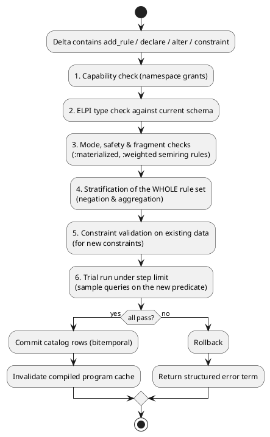

# Rules

The program — rules, declarations and constraints — is data stored in the database, versioned bitemporally and changed only through a validation gate.

## Program As Data

Rules and declarations are stored as quoted λProlog terms in the [[storage#Catalog]]; `.elpi` files are only an import/export format.

- One file holds facts *and* the program that interprets them ([[decisions#D8 DB is source of truth]]).
- Rules are bitemporal: `as_of T Goal` evaluates with the rules current at `T` ("what would I have concluded last week?").
- Every rule records author namespace and provenance (`src`), e.g. `authored_by agent7 (reflection episode_42)`.
- `elpilite import prog.elpi` and `elpilite export --as-of T` convert between file and database forms.

## Loading

For each snapshot the loader assembles the current clauses into an ELPI program, runs the rewrite passes, and caches the compiled result keyed by catalog version.

The compiled program is invalidated only when a catalog row changes; fact-only transactions reuse it. See [[evaluation#Rewrite Pipeline]].

## Validation Gate

Every runtime change to rules, declarations or constraints must pass the same ordered checks before commit.



Errors are **structured terms**, designed for LLM self-repair:

```prolog
error (type_error (clause 3) (arg 2) (expected entity) (got string))
error (unstratified [colleague, not_colleague])
error (unsafe_negation (not (manager X M)) [M])
error (step_limit 100000 (pred reach))
error (capability_denied agent7 add_rule shared)
```

The MCP and Node interfaces return them as JSON with the same structure ([[interfaces#Wire Format]]).

## Schema Evolution

Additive schema changes are ordinary transactions; breaking changes go through an explicit ELPI migration that closes the old relation bitemporally.

| Change | Mechanism |
|---|---|
| add relation | `declare` |
| add column with default / nullable | `alter (add_column R Name Type Default)` |
| add constraint | `alter (add_constraint C)` — validated on current data |
| change column type, split/merge relations, drop relation | `migrate (migration Name From To Rules)` |

A migration is a set of ELPI rules mapping old facts to new ones. The engine runs them in one transaction, writes the new relation, and closes `tx_to` on the old relation's catalog entry — history remains queryable with `as_of`.

## Capabilities

Namespaces carry capability grants that restrict who can read, assert facts, add rules or alter schema.

| capability | allows |
|---|---|
| `read` | query facts in the namespace |
| `assert_fact` | `assert` / `retract` / `correct` |
| `assert_rule` | `add_rule` / `drop_rule` |
| `alter_schema` | `declare` / `alter` / `migrate` |
| `forget` | physical deletion ([[memory#Forgetting]]) |

Typical setup: each agent owns a scratch namespace with all capabilities; a `shared` namespace grants agents `read` + `assert_fact` only.
