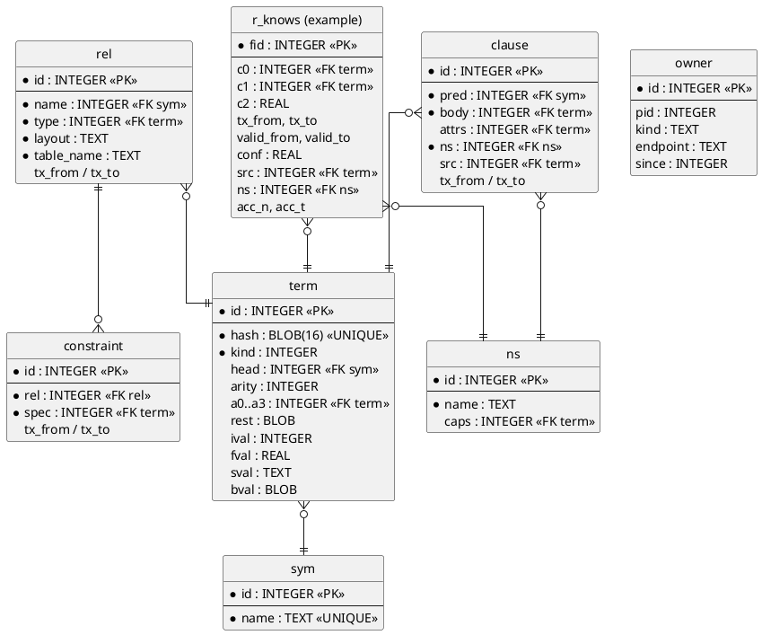

# Storage

Physical persistence: a backend-neutral `Store` signature over Turso (primary) and SQLite (differential twin), a hash-consed term DAG, a catalog, and bitemporal fact rows.

## Store Signature

All SQL access goes through one OCaml module signature so backends are swappable and no SQL dialect leaks into the language layer.

```ocaml
module type STORE = sig
  type t
  type stmt
  type cursor
  val open_     : path:string -> mode:[`Rw | `Ro] -> t
  val prepare   : t -> string -> stmt
  val bind      : stmt -> Value.t array -> unit
  val cursor    : stmt -> cursor              (* lazy, streaming *)
  val next      : cursor -> Value.t array option
  val exec      : t -> string -> Value.t array -> unit
  val begin_tx  : t -> unit
  val commit    : t -> unit
  val rollback  : t -> unit
  val vector    : t -> (module Vector_index.S)
end
```

The signature is written in direct style but keeps every call a single request/response so a future async (JS promise) bridge can implement it; see [[interfaces#Node Addon]].

### Turso Backend

The primary backend links `sqlite3-ocaml` against Turso's sqlite3-compatible C library, in single-writer (non-MVCC) mode.

MVCC / `BEGIN CONCURRENT` is not used in v1: at the time of design it cannot be combined with indexes and loads the whole dataset into memory, and the engine depends on indexes everywhere. See [[decisions#D4 Turso primary]].

If a required `sqlite3_*` entry point is missing from Turso's C API, the fallback is a thin C/Rust shim — detected in milestone M0 ([[roadmap#M0 Build Spike]]).

### SQLite Backend

Stock SQLite plus the sqlite-vec extension implements the same signature and exists for differential testing and as an escape hatch.

Every test suite runs against both backends and results are diffed ([[roadmap#Testing Strategy]]). Only [[vectors#Vector Index]] differs between the two.

## Term DAG

All non-scalar λProlog terms are stored once in a hash-consed DAG; relation columns hold scalars or term ids.

- **Symbols** (functor names, string constants used as atoms) are interned in `sym`.
- **Terms** are rows keyed by a content hash of `(kind, head, children)`, so structurally equal terms share one id.
- **Binders** are stored in de Bruijn form: `lam` nodes have no names, bound variables are `bvar k`. α-equivalent terms therefore get the same id.
- **Stored facts are ground** (no unification variables) except under binders; non-ground knowledge must be a rule. See [[decisions#D2 Term DAG]].
- The top-level functor and arity are stored on each term row so patterns like `about M (project _)` can be pushed down ([[evaluation#Conjunction Pushdown#Term Pattern Pushdown]]).
- An in-process LRU cache maps `term_id ↔ ELPI term` to avoid recursive fetches for hot terms.

### Term Encoding

Term kinds and the columns they use; `a0..a3` inline the first children and `rest` spills longer argument lists.

| kind | meaning | columns used |
|---|---|---|
| `int` / `float` / `str` | boxed scalar inside a compound | `ival` / `fval` / `sval` |
| `const` | constant / nullary constructor | `head` |
| `app` | `head a0 … an` | `head`, `arity`, `a0..a3`, `rest` (blob of ids) |
| `lam` | binder | `a0` (body) |
| `bvar` | de Bruijn index | `ival` |
| `vec` | embedding payload | `bval` (float32 blob), `ival` (dim) |

Hash is BLAKE3 truncated to 128 bits over a canonical binary encoding; the integer `id` is the rowid, and `hash` is `UNIQUE`.

## Catalog

The catalog persists every declaration, constraint and rule as quoted λProlog terms, bitemporally versioned like facts.

- `rel` — one row per `:persistent` predicate: name, ELPI type (as term id), column layout, physical table name.
- `constraint` — keys, unique, functional dependencies, foreign keys, cardinality ([[language#Constraints]]).
- `clause` — rules (IDB) as quoted terms with attributes (`:materialized`, `:weighted`), author namespace and provenance ([[rules#Program As Data]]).
- `ns` — namespaces and their capability grants ([[rules#Capabilities]]).
- `owner` — current writer process ([[interfaces#Writer Ownership]]).
- `meta` — format version, engine version, current transaction id.

## Bitemporal Rows

Every stored relation table carries system columns for transaction time, valid time, confidence, provenance and namespace.

| column | type | meaning |
|---|---|---|
| `fid` | INTEGER PK | fact id (stable across metadata queries) |
| `c0..cn` | per type | user columns: INTEGER / REAL / TEXT or term id |
| `tx_from` | INTEGER | transaction that asserted the row |
| `tx_to` | INTEGER NULL | transaction that retracted it; `NULL` = current |
| `valid_from` | INTEGER | world-time start (epoch µs; default `-∞`) |
| `valid_to` | INTEGER NULL | world-time end; `NULL` = open |
| `conf` | REAL | confidence in [0,1], default 1.0 |
| `src` | INTEGER | provenance term id (`observed …`, `tool …`, `derived_by …`) |
| `ns` | INTEGER | namespace id |
| `acc_n`, `acc_t` | INTEGER | access count / last access (batched, see [[memory#Access Tracking]]) |

Indexes: a partial index `WHERE tx_to IS NULL` over each declared key and each `:index` spec for current-state lookups, plus a full `(c_k, tx_from, tx_to)` index for `as_of` queries.

Retraction never deletes: it sets `tx_to`. Physical removal happens only through [[memory#Forgetting]].

## Physical Schema

The system tables and one example user relation, as an entity-relationship diagram.


